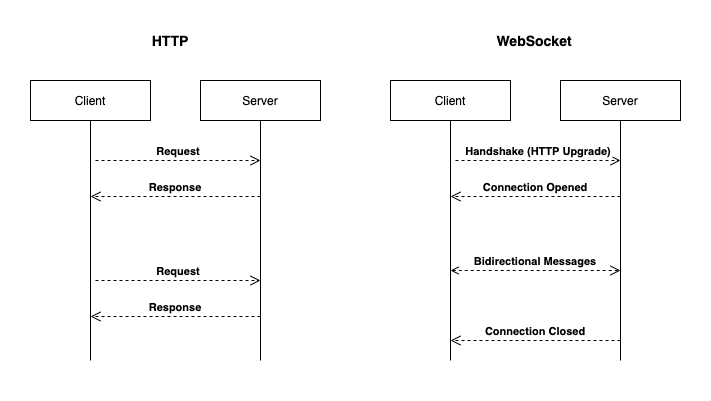
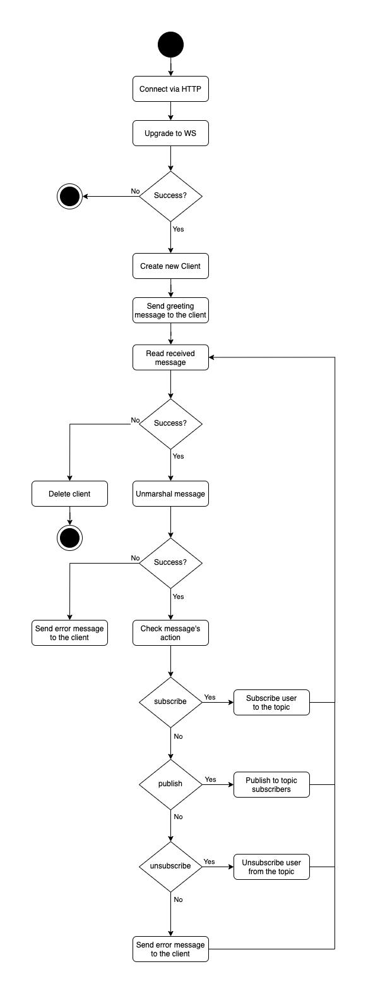

# Websocket Server in Go

## Running the server
1. Clone this repository

2. Mount the repository & run this command to install dependencies
```
make setup
```

3. Run the websocket server
```
make run
```

4. Websocket server will be running on `localhost:8080`

## Using this server with client
1. After running the server, open your Websocket client. If you don't have any, try `Websocket King` extension for chrome.

2. Connect to `ws://localhost:8080/socket`, you will be greeted by the server.
```
Server: Welcome! Your ID is f0ab664a-5af3-4f8d-8afe-eb93085267e4
```

3. To subscribe to a topic, send this payload (*topic can be anything*)
```
{
  "action": "subscribe",
  "topic": "world"
}
```

4. To send a message to the topic's subscribers, send payload in this format
```
{
  "action": "publish",
  "topic": "world",
  "message": "Hello world!"
}
```

5. To unsubscribe from the topic, send this payload (*topic can be anything*)
```
{
  "action": "unsubscribe",
  "topic": "world"
}
```

## HTTP vs WebSocket

You might be asking "why should I use Websocket instead of REST API"?

REST API uses HTTP which can only send response once per request. 

Meanwhile, WebSocket can be used for persistent bidirectional communication without the need of reestablishing connection everytime. 

This can be useful in some scenario like chatting or pub-sub.

Here is the diagram to visualize the difference between HTTP and WebSocket.



## Flowchart
This flowchart describes how this server works.


## Project Structure
```
cmd
└── main
    └── main.go
internal
└── websocket
    └── handler.go
    └── model.go
    └── server.go
```
### Main files
**main.go**: the main file to be executed.

### Handler

**handler.go**: handles open/close connection & pass the message to the server.

### Model

**model.go**: stores the models used by the server.

### Server
**server.go**: runs specific action according to the client message, also containes functions that needed by the server to work properly as a websocket server.

## Further Work

This repository is far from ideal. It's just a proof-of-concept.

While this repository is close to a pub-sub, it can still be used for a chat server. 

For example, we can add a function on socket connected so that client will be automatically subscribes to their own ID as a topic. Other clients then will use those user's ID as a topic to publish a message.

I have tried building such solution combined with Authorization to prevent other user from subscribing to other's ID and it does work.

## Credit
This repository is inspired by [Golang-PubSub by @tabvn](https://github.com/tabvn/golang-pubsub-youtube)